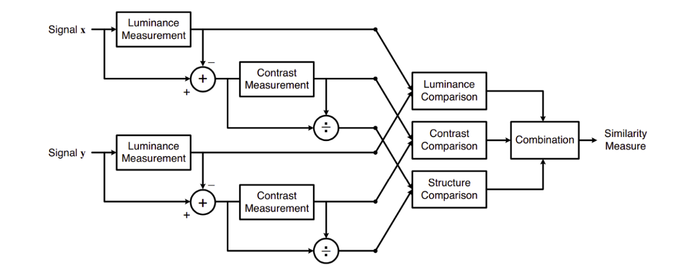

# Peak Signal to Noise Ratio

Para calcular la potencia de la señal discreta usamos la siguiente formula:

$$P_s = \sum_{-\infty}^{\infty}s^2[n] = \left|s[n]\right|^2.$$

Podemos aplicar esta noción al ruido 𝑤 sobre una señal para calcular 𝑃𝑤 de la misma manera. La relación señal/ruido (SNR) es entonces:
$$P_{SNR}=\frac{P_s}{P_w}$$

Si hemos recibido una señal corrupta 𝑥 [𝑛] = 𝑠 [𝑛] + 𝑤 [𝑛] entonces calculamos la SNR de la siguiente manera:
$$P_{SNR}=\frac{P_s}{P_w} = \frac{P_s}{\left|x[n]-s[n]\right|^2}.$$

Aquí $\left|x[n]-s[n]\right|^2$ es simplemente el error cuadratico entre la señal original y la corrupta. Tenga en cuenta que si escalamos la definición de potencia por el número de puntos en la señal, este habría sido el error cuadrático medio (MSE), pero como estamos tratando con proporciones de potencias, el resultado sigue siendo el mismo.

Interpretemos ahora este resultado. Esta es la relación entre la potencia de la señal y la potencia del ruido. La potencia de una señal es, en cierto sentido, la norma al cuadrado de su señal. Muestra cuánta desviación al cuadrado tiene en promedio con respecto a 0.

Si queremos extender esta noción a las imágenes, simplemente sumamos el doble de filas y columnas de su vector de imagen, o simplemente estirando su imagen completa en un solo vector de píxeles y aplicando la definición unidimensional. Puede ver que no hay información espacial codificada en la definición de potencia.

Ahora veamos la definicion de **Peak Signal to Noise Ratio**:
$$P_{PSNR}=\frac{\text{max}(s^2[n])}{\text{MSE}}.$$

Realmente esta definición es la misma que la de 𝑃𝑆𝑁𝑅, excepto que el numerador de la relación es ahora la intensidad máxima al cuadrado de la señal, no la media. Esto hace que este criterio sea menos estricto. Puedes ver que 𝑃𝑃𝑆𝑁𝑅≥𝑃𝑆𝑁𝑅 y que solo serán iguales entre sí si tu señal limpia original es constante en todas partes y con la máxima amplitud. Observe que aunque la varianza de una señal constante es nula, su potencia no lo es; el nivel de dicha señal constante hace una diferencia en SNR pero no en PSNR.

Ahora bien, ¿por qué tiene sentido esta definición? Tiene sentido porque en el caso de SNR estamos viendo qué tan fuerte es la señal y qué tan fuerte es el ruido. Asumimos que no existen circunstancias especiales. De hecho, esta definición se adapta directamente de la definición física de energía eléctrica. En el caso de PSNR, estamos interesados en el pico de la señal porque nos pueden interesar cosas como el ancho de banda de la señal o la cantidad de bits que necesitamos para representarla. Esto es mucho más content-specific que el SNR puro y puede tener muchas mas aplicaciones razonables, entre ellas la compresión de imágenes. Aquí decimos que lo que importa es qué tan bien las regiones de alta intensidad de la imagen atraviesan el ruido, y estamos prestando mucha menos atención a cómo nos desempeñamos con baja intensidad.

Para imágenes en color con tres valores RGB por píxel, la definición de PSNR es la misma, excepto que el MSE es la suma de todas las diferencias de valor al cuadrado (ahora para cada color, es decir, tres veces más diferencias que en una imagen monocromática) dividida por el tamaño de la imagen. y por tres. Alternativamente, para las imágenes en color, la imagen se convierte a un espacio de color diferente y el PSNR se informa en cada canal de ese espacio de color. PSNR es generalmente expresada en escala de decibeles, es decir como una cantidad logaritmica

# Structural Similarity
SSIM se introdujo por primera vez en el documento IEEE `Image Quality Assessment: From Error Visibility to Structural Similarity`. El resumen proporciona una buena intuición sobre la idea detrás del sistema propuesto,
-	Objective methods for assessing perceptual image quality traditionally attempted to quantify the visibility of errors (differences) between a distorted image and a reference image using a variety of known properties of the human visual system. Under the assumption that human visual perception is highly adapted for extracting structural information from a scene, we introduce an alternative complementary framework for quality assessment based on the degradation of structural information.

La metrica SSIM usa 3 caracteristicas clave de una imagen:
- Iluminacion
- Contraste
- Esctructura

### Pero, ¿qué calcula esta métrica?
Este sistema calcula el índice de similitud estructural entre 2 imágenes dadas, que es un valor entre -1 y +1. Un valor de +1 indica que las 2 imágenes dadas son muy similares o iguales, mientras que un valor de -1 indica que las 2 imágenes dadas son muy diferentes. A menudo, estos valores se ajustan para estar en el rango [0, 1], donde los extremos tienen el mismo significado.
Ahora, exploremos brevemente cómo se representan estas características y cómo contribuyen a la puntuación final de SSIM.

**Luminancia**: la luminancia se mide promediando todos los valores de píxeles. Se denota por μ (Mu) y la fórmula se da a continuación:
$$ \mu_x = \frac{1}{N} \sum_{i=1}^{N}{x_i}$$

**Contraste**: se mide tomando la desviación estándar (raíz cuadrada de la varianza) de todos los valores de píxeles. Se denota por σ (sigma) y se representa mediante la fórmula siguiente:
$$ \rho_x = \left(\frac{1}{N-1}\sum_{i=1}^{N}{(x_i-\mu_x)^2}\right)^{\frac{1}{2}}$$

**Estructura**: La comparación estructural se realiza dividiendo la señal de entrada con su desviación estándar para que el resultado tenga una desviación estándar unitaria que permite una comparación más sólida.

$$ \frac{\left(x-\mu_x\right)}{\rho_x} $$

Lo que nos falta ahora son funciones que puedan comparar las dos imágenes dadas en estos parámetros y, finalmente, una funcion que las combine todas.

**Función de comparación de luminancia**: se define mediante una función, $l(x, y)$ que se muestra a continuación. $\mu$ representa la media de una imagen dada. $x$ e $y$ son las dos imágenes que se comparan.
$$l(x,y)=\frac{2\mu_x\mu_y+C_1}{\mu_x^2\mu_y^2 + C_1}$$

donde $C1$ es una constante que asegura estabilidad cuando el denominador de vuelve 0,

**Función de comparación de contraste**: $\rho$ denota la desviacion estandard de una imagen dada.
$$ c(x,y) = \frac{2\rho_x\rho_y + C_2}{\rho_x^2 + \rho_y^2 + C_2}$$

**Función de comparación de estructura**: $\rho$ denota la desviacion estandard de una imagen dada.
$$ s(x,y) = \frac{\rho_xy + C_3}{\rho_x\rho_y + C_3}$$

Finalmente la metrica SSIM queda definida por:
$$ SSIM(x,y) = \left[l(x,y)\right]^\alpha\cdot\left[c(x,y)\right]^\beta\cdot\left[s(x,y)\right]^\gamma$$

donde $\alpha > 0, \beta > 0, \gamma > 0$ denota la importancia de cada metrica en la comparacion.